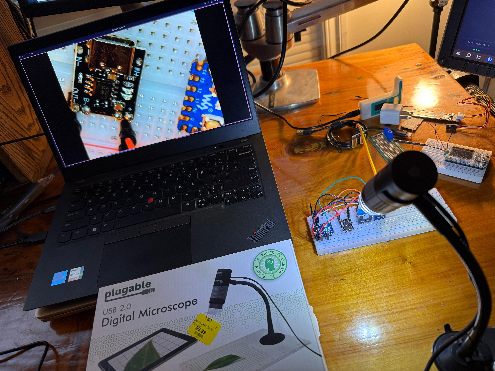
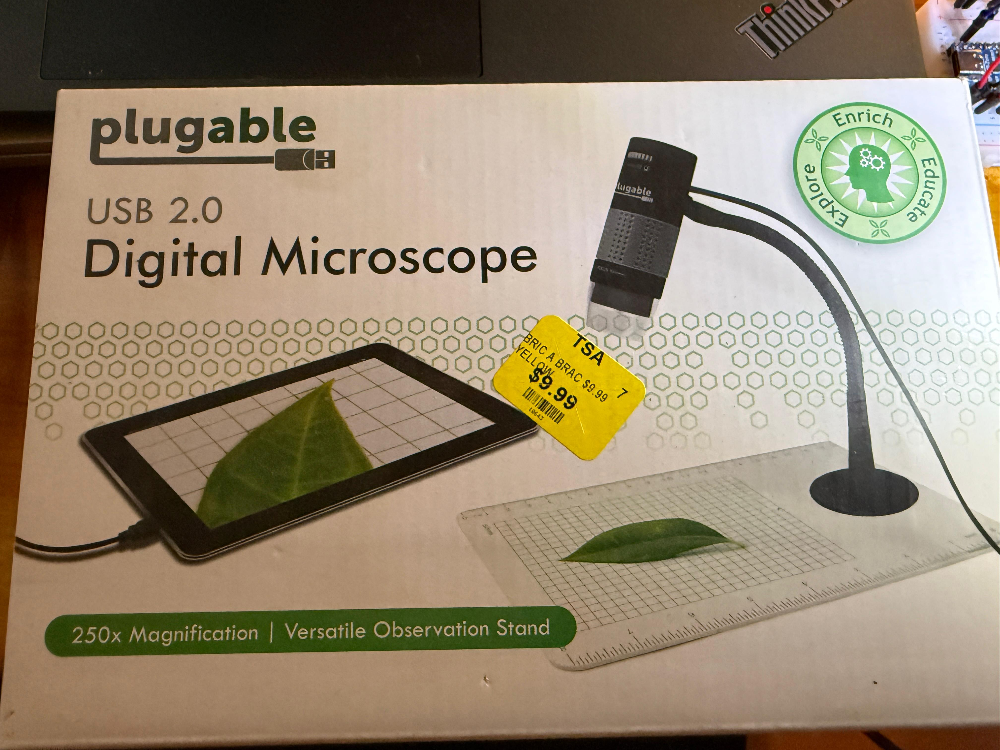
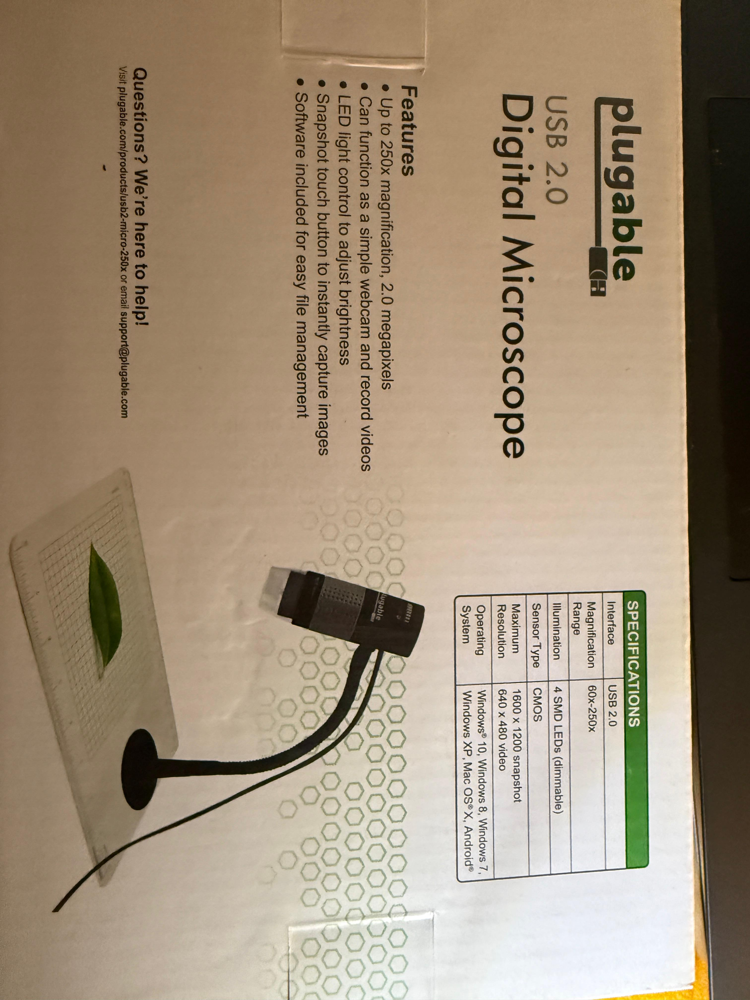
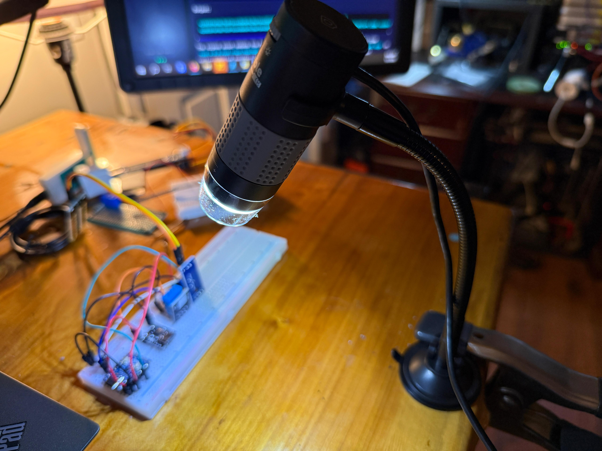

# Plugable Microscope Harness

vibecoded this to revive a very cheap usb microscope I thrifted and am now using for electronics



Cross-platform wrapper for the Plugable USB 2.0 Digital Microscope (USB2-MICRO-250x). Works with any UVC microscope or webcam whose USB product string contains `Plugable`, `Etron`, or `Microscope`.

## Install

### Arch / Manjaro / Ubuntu / Debian / Fedora / openSUSE
```sh
git clone https://github.com/zaphod-black/plugableMicroScope
cd plugableMicroScope
./setup.sh
```

### macOS
```sh
git clone https://github.com/zaphod-black/plugableMicroScope
cd plugableMicroScope
./setup.sh
```
Requires Homebrew.

### Windows (PowerShell)
```powershell
git clone https://github.com/zaphod-black/plugableMicroScope
cd plugableMicroScope
.\setup.ps1
```
Requires winget or scoop.

Plug in the microscope, search **Plugable Microscope** in your app launcher, or run `plugable-microscope` from a terminal.

## Controls

| input              | action                                              |
|--------------------|-----------------------------------------------------|
| click `[ SNAP ]`   | screenshot                                          |
| `Space`            | screenshot                                          |
| `Ctrl` + `Space`   | start / stop recording (red REC blinks top-left)    |
| `Alt` + `F`        | toggle autofocus (only if the device exposes it)    |
| `Q`                | quit                                                |

Saves land in `Captures/Pictures/` and `Captures/Videos/`, timestamped `microscope-YYYYMMDD-HHMMSS.{png,mkv}`. Override the destination with `PMS_CAPTURES=/some/path`.

Recordings are uncompressed YUYV in MKV (~20 MB/s). To shrink:
```sh
ffmpeg -i microscope-XXX.mkv -c:v libx264 -preset fast -crf 23 microscope-XXX.mp4
```

## Hardware




| spec        | value                              |
|-------------|------------------------------------|
| model       | USB2-MICRO-250x                    |
| sensor      | 2.0 MP CMOS                        |
| magnification | 80x to 250x                      |
| modes       | 1600x1200 @ 7 fps, 1280x720 @ 11 fps, 640x480 @ 30 fps |
| illumination | 4 dimmable SMD LEDs               |
| focus       | manual ring                        |
| reports as  | `Etron Technology, Inc. USB Microscope` |



## Other cameras

See [docs/other-cameras.md](docs/other-cameras.md) for adapting this wrapper to a different USB microscope, webcam, or capture device.

## Uninstall

```sh
# Linux
rm -f ~/.local/bin/plugable-microscope ~/.local/share/applications/plugable-microscope.desktop

# macOS
rm -rf ~/Applications/"Plugable Microscope.app" ~/.local/bin/plugable-microscope

# Windows (PowerShell)
Remove-Item "$env:LOCALAPPDATA\PlugableMicroscope" -Recurse -Force
Remove-Item "$env:APPDATA\Microsoft\Windows\Start Menu\Programs\Plugable Microscope.lnk"
```

## Troubleshooting

| symptom                              | fix                                                                              |
|--------------------------------------|----------------------------------------------------------------------------------|
| `not found`                          | unplug and replug                                                                |
| wrong device picked up               | `v4l2-ctl --list-devices` (Linux), `ffmpeg -f avfoundation -list_devices true -i ""` (mac), `Get-PnpDevice -Class Camera` (win) |
| `Command not found` from app search  | `./setup.sh` again, then re-search                                               |
| huge recording files                 | use the `ffmpeg` re-encode line above                                            |
| `~/.local/bin` not on PATH (Linux)   | add `export PATH="$HOME/.local/bin:$PATH"` to your shell rc                      |
